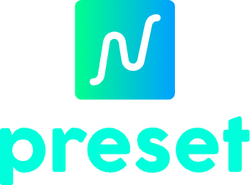

 <a href="./README.md">English</a> | 简体中文

Automatically generate preset files for some commonly used frameworks

## :coffee:

[请我喝一杯咖啡](https://github.com/Simon-He95/sponsor)

## License

[MIT](./license)
